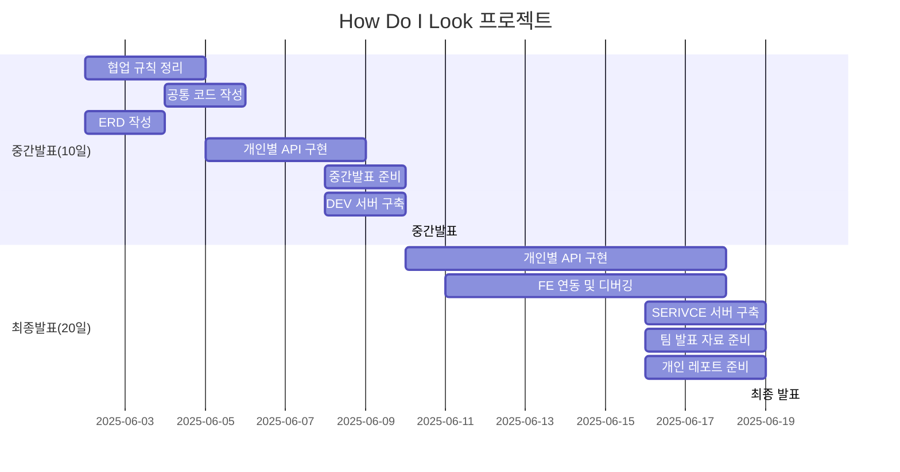
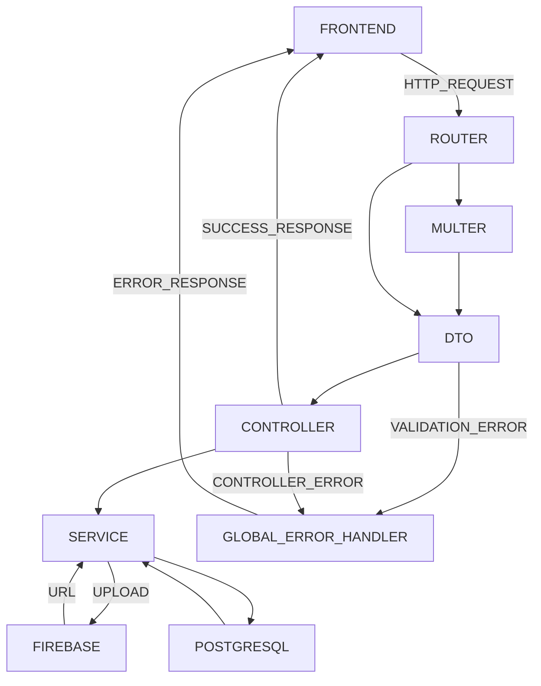

# TEAM 1

**팀 위키**: [깃허브 위키](https://github.com/gyunam-bark/nb02-how-do-i-look-team1/wiki)

**팀 이슈**: [깃허브 이슈](https://github.com/gyunam-bark/nb02-how-do-i-look-team1/issues?q=is%3Aissue%20state%3Aclosed)

**팀 PR**: [깃허브 PR](https://github.com/gyunam-bark/nb02-how-do-i-look-team1/pulls?q=is%3Apr+is%3Aclosed)

## 팀원 구성

|  이름  | 역할 | 담당 업무                                                                                                                                      | 깃허브                                                                 |
| :----: | :--: | ---------------------------------------------------------------------------------------------------------------------------------------------- | ---------------------------------------------------------------------- |
| 박규남 | 팀장 | PM, Tag API, Log Api, Health Check API, DTO 미들웨어, Global Error Handler 미들웨어, PR-디스코드 연동, 이슈-구글 시트 연동, Swagger 연동, 배포 | [https://github.com/gyunam-bark](https://github.com/gyunam-bark)       |
| 권나현 | 팀원 | Style API, Prisma Schema 설계, Seed 데이터 설계 및 작성                                                                                        | [https://github.com/kwonnahyun0125](https://github.com/kwonnahyun0125) |
| 김슬비 | 팀원 | Curation API                                                                                                                                   | [https://github.com/stella62420](https://github.com/stella62420)       |
| 김진솔 | 팀원 | Image API, Ranking API, Prisma Schema 설계                                                                                                     | [https://github.com/JINSOLdev](https://github.com/JINSOLdev5)          |
| 하상준 | 팀원 | Comment API, 비밀번호 해싱/비교 유틸리티                                                                                                       | [https://github.com/hippo8427](https://github.com/hippo8427)           |

---

## 프로젝트 소개

- 스타일 공유 및 큐레이팅 서비스 백엔드 시스템 구축

- **프로젝트 기간**: 2025.06.02 ~ 2025.06.20



---

## 기술 스택

|     분류     | 사용 도구                                                                             |
| :----------: | ------------------------------------------------------------------------------------- |
|    백엔드    | node.js, express.js                                                                   |
|     ORM      | prisma                                                                                |
| 데이터베이스 | postgresql                                                                            |
|  API 문서화  | swagger                                                                               |
|  협업 도구   | git, github, discord                                                                  |
|  일정 관리   | github webhook, google run function, google apps script, google spreadsheet           |
| 설치 패키지  | dotenv, morgan, multer, cors, bcrypt, superstruct, firebase-admin, swagger-ui-express |
|   스토리지   | google firebase                                                                       |
|     배포     | render.com(프론트엔드,백엔드,데이터베이스)                                            |

---

## 백엔드 서비스 흐름



## 팀원별 구현 기능 상세

### 박규남


- [개인 개발 보고서](https://github.com/gyunam-bark/nb02-how-do-i-look-report)

**CI/CD**

- Github Issue 와 Google Spreadsheet 연동

  - Issue 생성 시 팀 Gantt 시트 실시간 업데이트를 위한 연동
  - [이슈 템플릿 문서](./.github/ISSUE_TEMPLATE/todo-template.md)
  - Github Issue -> Google Run Function
  - Google Run Function(Node.js, Axios) -> Google Apps Script
  - Google Apps Script -> Google Spreadsheet

- Github PR 과 Discord 연동

  - PR 생성 시 팀 디스코드에 알림(@맨션) 을 하기 위한 연동
  - [PR 템플릿 문서](./.github/PULL_REQUEST_TEMPLATE.md)
  - [PR 깃허브 액션](./.github/workflows/pr-to-discord.yml)
  - Github PR -> Github Actions
  - Github Actions -> Discord

**API**

- Tag(/tags)

  - 태그 목록을 받기 위한 API
  - [라우터 코드](./src/routes/tag-route.js)
  - [컨트롤러 코드](./src/controllers/tag-controller.js)
  - [서비스 코드](./src/services/tag-service.js)
  - 요청 예시

    ```json

    ```

  - 응답 예시
    ```json
    {
      "tags": ["string"]
    }
    ```

- Log(/logs)

  - 데이터베이스에 저장된 에러 로그 목록을 받기 위한 API
  - [라우터 코드](./src/routes/log-route.js)
  - [컨트롤러 코드](./src/controllers/log-controller.js)
  - [서비스 코드](./src/services/log-service.js)
  - [스키마](./prisma/schema.prisma#L118-L126)
  - 요청 예시

    ```json

    ```

  - 응답 예시
    ```json
    {
      "totalItemCount": 0,
      "data": [
        {
          "id": 1,
          "ip": "string",
          "url": "string",
          "method": "string",
          "statusCode": "string",
          "message": "string",
          "createdAt": "2025-06-18T01:02:32.664Z"
        }
      ]
    }
    ```

- Health Check(/)

  - 서버 헬스체크를 위한 API
  - [라우터 코드](./src/routes/root-route.js)
  - [컨트롤러 코드](./src/controllers/root-controller.js)
  - 요청 예시

    ```json

    ```

  - 응답 예시

    ```json
    {
      "status": "OK",
      "uptime": 0,
      "timestamp": "2025-06-18T01:02:32.664Z"
    }
    ```

**MIDDLEWARE**

- DTO

  - 파라미터를 검증하고, 필요에 따라 형변환을 하여 전달하기 위한 미들웨어
  - [미들웨어 코드](./src/middlewares/dto-middleware.js)
  - 각각의 파라미터 검증 후 req.validated 객체로 저장하여 Controller 에 전달
  - 에러 발생 시 Global Error Handler 로 에러 전달

- Global Error Handler
  - 발생하는 모든 에러 상황에 메세지를 반환하기 위한 미들웨어
  - [미들웨어 코드](./src/middlewares/error-middleware.js)
  - 표준 statusCode 기반(MDN 기준)
  - Service 반환 객체와 Dev 반환 객체가 다름

**DEPLOY**

- Swagger 연동

  - API 테스트를 위한 Swagger 연동
  - [라우터 코드](./src/routes/doc-route.js)
  - [미들웨어 코드](./src/middlewares/swagger-middleware.js)
  - [OPENAPI.JSON](./openapi.json)
  - API 명세서 바탕으로 openapi.json 정리

- 배포
  - RENDER(front-end, back-end, postgresql)
    - main 브랜치 커밋 연동
  - GODADDY(\*.nbo2-howdoilook.com)
  - DNS
    | 분류 | CNAME / A |
    | :----: | :----: |
    | 프론트엔드 | www |
    | 백엔드 | api |

### 권나현

(자신이 개발한 기능에 대한 사진이나 gif 파일 첨부)

- [개인 개발 보고서](https://github.com/kwonnahyun0125/How-Do-I-Look-Report/blob/main/README.md)

**API**

- Style (/styles)

  - 스타일 등록/조회/상세조회/수정/삭제를 하기 위한 API
  - Style 등록/수정 시 태그(name→findOrCreate→연결), 카테고리(객체→배열 변환), 이미지(업로드/연결) 등
    다대다/1:N 구조 처리
  - Prisma 관계설정 기반으로 중간 테이블 자동 연결/갱신
  - FE 요구사항 반영해 style, tags, categories, imageUrls 모두 명세대로 직렬화/포맷 맞춤 응답
  - Style 삭제 시 외래키 제약(PK-FK) 오류 발생 문제 해결 (cascade delete 등 적용)
  - [라우터 코드](./src/routes/style-route.js)
  - [컨트롤러 코드](./src/controllers/style-controller.js)
  - [서비스 코드](./src/services/style-service.js)

  - API 요청/응답 예시 (201 Created)

  ```json
  {
    "id": 1,
    "nickname": "나현",
    "title": "여름 데일리룩",
    "content": "시원하게 입는게 최고!",
    "viewCount": 0,
    "curationCount": 0,
    "createdAt": "2025-06-18T09:12:37.365Z",
    "categories": {
      "top": {
        "name": "반팔티",
        "brand": "유니클로",
        "price": 19900
      },
      "bottom": {
        "name": "숏팬츠",
        "brand": "지오다노",
        "price": 15900
      }
    },
    "tags": ["캐주얼", "미니멀", "여름"],
    "imageUrls": ["https://img.example.com/style1.jpg", "https://img.example.com/style2.jpg"]
  }
  ```

**Prisma**

- Schema

  - 데이터베이스 구조 설계
  - [스키마 코드](./prisma/schema.prisma)

- Seed 데이터 설계
  - `seed.js`에서 대량의 style/curation/comment 샘플 자동 생성, 실이미지 URL 적용, password 정책 일치화
  - 실사용 테스트를 위한 실시간 데이터(프론트/백 모두) 공유 가능하게 구조화
  - [시드 코드](./prisma/seed.js)
  - `seed.js` 주요 코드\*\*
  ```json
  for (const [i, styleData] of styleDatas.entries()) {
    // ... style 생성 ...
  }
  for (const curation of curationSeeds) {
    // ... curation 생성 ...
  }
  for (const [i, comment] of commentSeeds.entries()) {
    // ... comment 생성 ...
  }
  ```

### 김슬비

(자신이 개발한 기능에 대한 사진이나 gif 파일 첨부)

- [개인 개발 보고서]()

- 기능 1

  - 세부설명 1
  - 세부설명 2

- 기능 2
  - 세부설명 1

### 김진솔

- [개인 개발 보고서](https://www.notion.so/jinsoldev/211985c94195804b8b58e0f6b5474342?source=copy_link)

**API**

- Ranking (/ranking)

  - 스타일 랭킹 목록 조회 및 페이지네이션 처리를 위한 API
  - [라우터 코드](./src/routes/rank-route.js)
  - [컨트롤러 코드](./src/controllers/rank-controller.js)
  - [서비스 코드](./src/services/rank-service.js)
  - 응답 예시

  ```json
  {
    "currentPage": 1,
    "totalPages": 5,
    "totalItemCount": 50,
    "data": [
      {
        "id": 1,
        "thumbnail": "string",
        "nickname": "string",
        "title": "string",
        "tags": ["string", "string"],
        "categories": {
          "top": {
            "name": "string",
            "brand": "string",
            "price": 0
          }
        },
        "viewCount": 100,
        "curationCount": 20,
        "createdAt": "2024-02-22T07:47:49.803Z",
        "ranking": 1,
        "rating": 3.7
      }
    ]
  }
  ```

- Image Upload (/images)

  - 이미지 업로드를 위한 API
  - [라우터 코드](./src/routes/image-route.js)
  - [컨트롤러 코드](./src/controllers/image-controller.js)
  - [서비스 코드](./src/services/image-service.js)

  - 요청 헤더

    ```json
    {
      "content-Type": "multipart/form-data"
    }
    ```

  - 요청 예시
    ```json
    {
      "image": "File"
    }
    ```
  - 응답 예시
    ```json
    {
      "imageUrl": "string"
    }
    ```

**Schema**

- 데이터베이스 구조 설계
- 카테고리 분류를 위한 `CategoryType` enum을 도입하여 데이터 정합성 및 일관성 확보
- [스키마 코드](./prisma/schema.prisma)

### 하상준

- [개인 개발 보고서](https://github.com/hippo8427/how-do-i-look-report)

**API**

- Comment(/comments)

  - 큐레이션에 답글을 달기 위한 API
  - [라우터 코드](./src/routes/comment-route.js)
  - [컨트롤러 코드](./src/controllers/comment-controller.js)
  - [서비스 코드](./src/services/comment-service.js)

  - 요청 예시

    ```json
    {
      "content": "string",
      "password": "string"
    }
    ```

  - 응답 예시
    ```json
    {
      "id": 123,
      "nickname": "string",
      "content": "string",
      "createdAt": "2024-02-22T07:47:49.803Z"
    }
    ```

**MIDDLEWARE/UTIL**

- PASSWORD HASHING (비밀번호 단방향 암호화)

  - 보안을 위해 답글 등록 시 password 필드를 bcrypt를 사용해 단방향 해싱 처리
  - [미들웨어 코드](./src/middlewares/bcrypt-middleware.js)

  - [해싱 유틸 코드](./src/utils/hash-password.js)

  - 수정/삭제 시 password 검증을 위해  
    요청의 평문 비밀번호와 저장된 해시된 비밀번호를 비교

  - [인증 유틸 코드](./src/utils/compare-password.js)

  - POST 사용 예시

    ```js
    import { hashPasswordMiddleware } from '../middlewares/bcrypt-middleware.js';

    router.post('/', validateRequest(createStyleSchema), hashPasswordMiddleware, StyleController.createStyle);
    ```

  - PUT/DELETE 사용 예시

    ```js
    import { comparePassword } from '../utils/compare-password.js';

    const isMatch = await comparePassword(plainPassword, hashedPassword);
    if (!isMatch) {
      const error = new Error();
      error.statusCode = 403;
      throw error;
    }
    ```

---

## 파일 구조

```bash
NB02-HOW-DO-I-LOOK-TEAM1
┣ .github
┃ ┣ ISSUE_TEMPLATE
┃ ┃ ┣ todo-template.md
┃ ┣ workflows
┃ ┃ ┣ pr-to-discord.yml
┃ ┣ PULL_REQUEST_TEMPLATE.md
┣ prisma
┃ ┣ schema.prisma
┃ ┣ seed.js
┣ src
┃ ┣ config
┃ ┃ ┣ db.js
┃ ┃ ┣ firebase-admin.js
┃ ┃ ┣ uploads-path.js
┃ ┣ controllers
┃ ┃ ┣ comment-controller.js
┃ ┃ ┣ curation-controller.js
┃ ┃ ┣ image-controller.js
┃ ┃ ┣ log-controller.js
┃ ┃ ┣ rank-controller.js
┃ ┃ ┣ root-controller.js
┃ ┃ ┣ style-controller.js
┃ ┃ ┣ tag-controller.js
┃ ┣ middlewares
┃ ┃ ┣ bcrypt-middleware.js
┃ ┃ ┣ dto-middleware.js
┃ ┃ ┣ error-middleware.js
┃ ┃ ┣ multer-middleware.js
┃ ┃ ┣ swagger-middleware.js
┃ ┣ routes
┃ ┃ ┣ comment-route.js
┃ ┃ ┣ curation-route.js
┃ ┃ ┣ doc-route.js
┃ ┃ ┣ image-route.js
┃ ┃ ┣ log-route.js
┃ ┃ ┣ rank-route.js
┃ ┃ ┣ root-route.js
┃ ┃ ┣ style-route.js
┃ ┃ ┣ tag-route.js
┃ ┣ services
┃ ┃ ┣ comment-service.js
┃ ┃ ┣ curation-service.js
┃ ┃ ┣ image-service.js
┃ ┃ ┣ log-service.js
┃ ┃ ┣ rank-service.js
┃ ┃ ┣ style-service.js
┃ ┃ ┣ tag-service.js
┃ ┣ utils
┃ ┃ ┣ compare-password.js
┃ ┃ ┣ hash-password.js
┃ ┣ server.js
┣ .env.example
┣ .gitignore
┣ .prettierrc
┣ eslint.confing.js
┣ index.js
┣ openapi.json
┣ package-lock.json
┣ package.json
┣ README.md
```

---

## 구현 홈페이지

**프론트엔드**: [www.nb02-howdoilook.com](www.nb02-howdoilook.com)

**백엔드**: [api.nb02-howdoilook.com](api.nb02-howdoilook.com)

---

## 프로젝트 회고록

(제작한 발표자료 링크 혹은 첨부파일 첨부)
