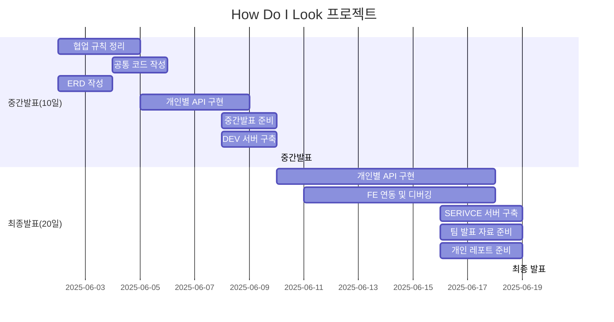
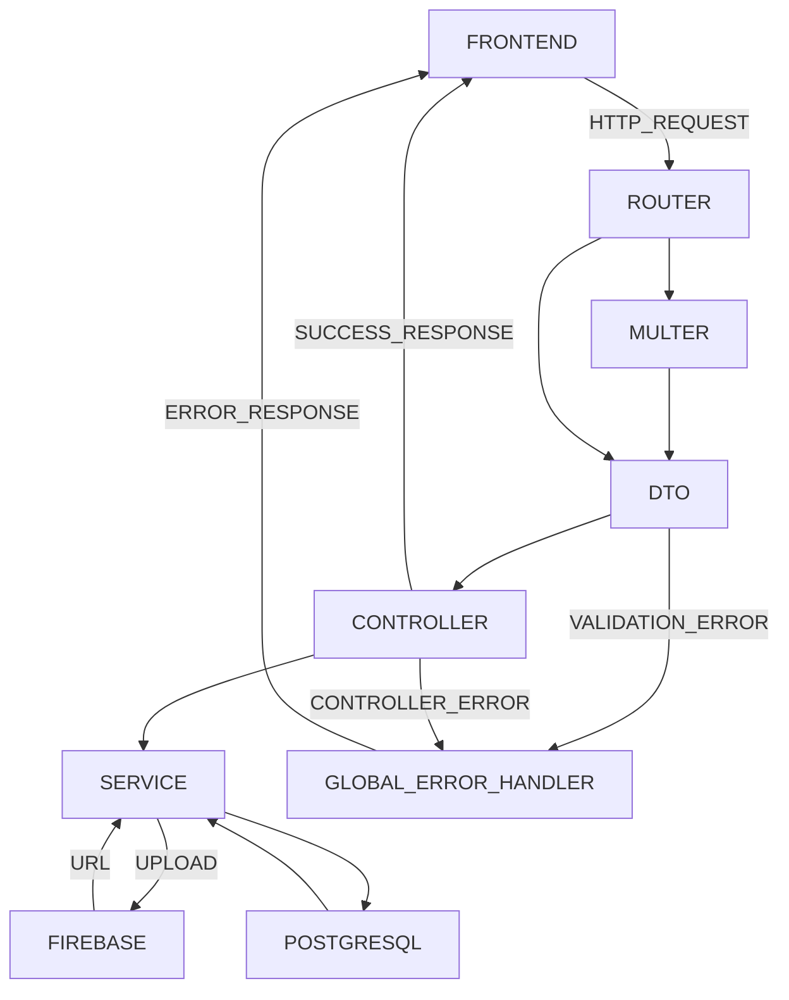

# TEAM 1

**팀 위키**: [깃허브 위키](https://github.com/gyunam-bark/nb02-how-do-i-look-team1/wiki)

**팀 이슈**: [깃허브 이슈](https://github.com/gyunam-bark/nb02-how-do-i-look-team1/issues?q=is%3Aissue%20state%3Aclosed)

**팀 PR**: [깃허브 PR](https://github.com/gyunam-bark/nb02-how-do-i-look-team1/pulls?q=is%3Apr+is%3Aclosed)

## 팀원 구성

|  이름  | 역할 | 담당 업무 | 깃허브                                                                 |
| :----: | :--: | --------- | ---------------------------------------------------------------------- |
| 박규남 | 팀장 |           | [https://github.com/gyunam-bark](https://github.com/gyunam-bark)       |
| 권나현 | 팀원 |           | [https://github.com/kwonnahyun0125](https://github.com/kwonnahyun0125) |
| 김슬비 | 팀원 |           | [https://github.com/stella62420](https://github.com/stella62420)       |
| 김진솔 | 팀원 |           | [https://github.com/JINSOLdev](https://github.com/JINSOLdev5)          |
| 하상준 | 팀원 |           | [https://github.com/hippo8427](https://github.com/hippo8427)           |

---

## 프로젝트 소개

- 스타일 공유 및 큐레이팅 서비스 백엔드 시스템 구축

- **프로젝트 기간**: 2025.06.02 ~ 2025.06.20



---

## 기술 스택

|     분류     | 사용 도구                                                 |
| :----------: | --------------------------------------------------------- |
|    백엔드    | node.js, express.js                                       |
|     ORM      | prisma                                                    |
| 데이터베이스 | postgresql                                                |
|  API 문서화  | swagger                                                   |
|  협업 도구   | git, github, discord                                      |
|  일정 관리   | github webhook, google runs function, google spread sheet |
| 설치 패키지  | dotenv, morgan, multer, cors, bcrypt, superstruct         |
|   스토리지   | google firebase                                           |
|     배포     | render.com(프론트엔드,백엔드,데이터베이스)                |

---

## 백엔드 서비스 흐름



## 팀원별 구현 기능 상세

### 박규남

(자신이 개발한 기능에 대한 사진이나 gif 파일 첨부)

- 기능 1

  - 세부설명 1
  - 세부설명 2

- 기능 2
  - 세부설명 1

### 권나현

(자신이 개발한 기능에 대한 사진이나 gif 파일 첨부)

- 기능 1

  - 세부설명 1
  - 세부설명 2

- 기능 2
  - 세부설명 1

### 김슬비

(자신이 개발한 기능에 대한 사진이나 gif 파일 첨부)

- 기능 1

  - 세부설명 1
  - 세부설명 2

- 기능 2
  - 세부설명 1

### 김진솔

(자신이 개발한 기능에 대한 사진이나 gif 파일 첨부)

- 기능 1

  - 세부설명 1
  - 세부설명 2

- 기능 2
  - 세부설명 1

### 하상준

(자신이 개발한 기능에 대한 사진이나 gif 파일 첨부)

- 기능 1

  - 세부설명 1
  - 세부설명 2

- 기능 2
  - 세부설명 1

---

## 파일 구조

```bash

```

---

## 구현 홈페이지

**프론트엔드**: [링크가 여기 들어갑니다.]()

**백엔드**: [링크가 여기 들어갑니다.]()

---

## 프로젝트 회고록

(제작한 발표자료 링크 혹은 첨부파일 첨부)
